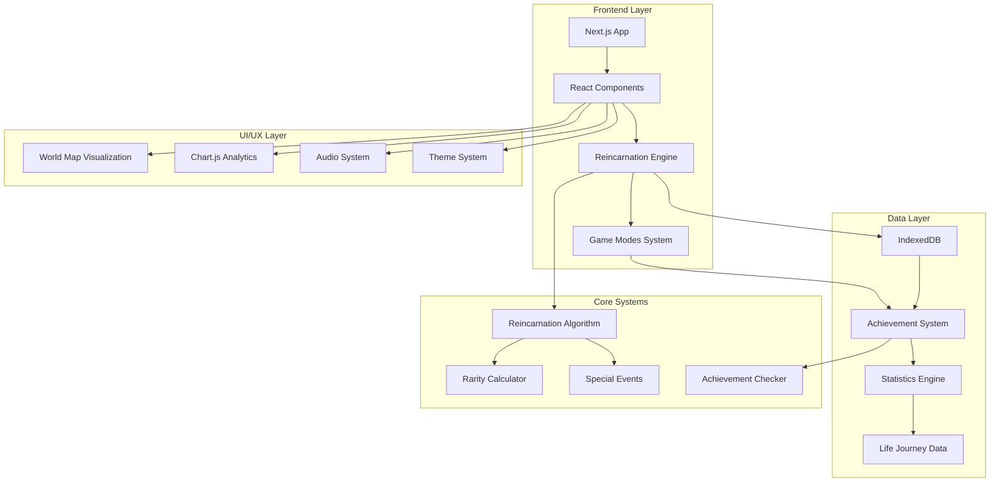
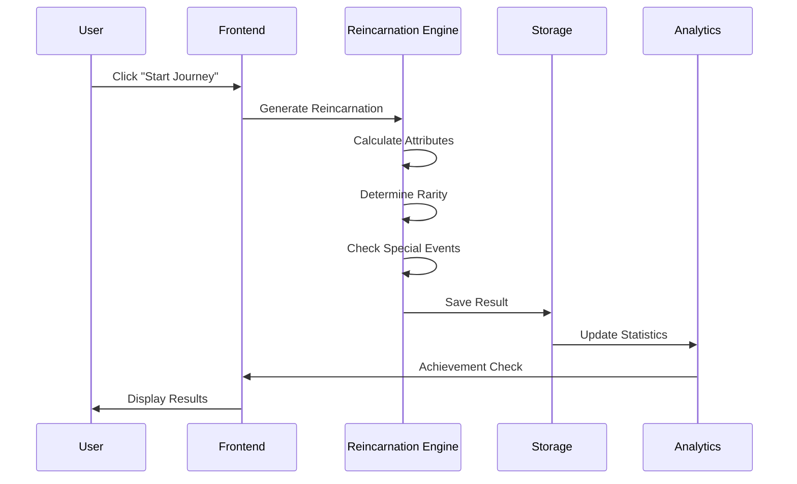

<div align="center"><a name="readme-top"></a>

[](#)

# 🌌 Journey of Reincarnation<br/><h3>Interactive Life Simulation & Reincarnation Experience Platform</h3>

An immersive web application that simulates the mystical experience of reincarnation across different countries, eras, and circumstances.<br/>
Supports multiple game modes, achievement systems, and advanced data visualization.<br/>
One-click **FREE** exploration of infinite life possibilities.

[Live Demo][project-link] · [Changelog][changelog] · [Documentation][docs] · [Features][features] · [Issues][github-issues-link]

<br/>

[][project-link]

<br/>

<!-- SHIELD GROUP -->
[![][github-release-shield]][github-release-link]
[![][vercel-shield]][vercel-link]
[![][github-stars-shield]][github-stars-link]
[![][github-forks-shield]][github-forks-link]<br/>
[![][github-contributors-shield]][github-contributors-link]
[![][github-issues-shield]][github-issues-link]
[![][github-license-shield]][github-license-link]<br>
[![][sponsor-shield]][sponsor-link]

**Share Project Repository**

[![][share-x-shield]][share-x-link]
[![][share-telegram-shield]][share-telegram-link]
[![][share-whatsapp-shield]][share-whatsapp-link]
[![][share-reddit-shield]][share-reddit-link]
[![][share-linkedin-shield]][share-linkedin-link]

<sup>🌟 Exploring the mysteries of life and rebirth through cutting-edge web technology. Built for spiritual explorers and simulation enthusiasts.</sup>

[![][github-trending-shield]][github-trending-url]

## 📸 Project Screenshots

> [!TIP]
> Experience the beautiful UI and comprehensive features of Journey of Reincarnation.

<div align="center">
  
  <p><em>Main Dashboard - Start Your Reincarnation Journey</em></p>
</div>

<div align="center">
  
  
  <p><em>Reincarnation Results and Interactive World Map</em></p>
</div>

<details>
<summary><kbd>📱 More Screenshots</kbd></summary>

<div align="center">
  
  <p><em>Comprehensive Data Analytics and Statistics</em></p>
</div>

</details>

## 🎬 Demo Video

> [!NOTE]
> Watch the Journey of Reincarnation experience in action.

<div align="center">

https://github.com/user-attachments/assets/3a3a434f-b14c-46c9-82b8-8c2962702560

*Interactive reincarnation simulation with real-time generation*

</div>

**Tech Stack Badges:**

<div align="center">


</div>

</div>

> [!IMPORTANT]
> This project demonstrates advanced React patterns, game mechanics, and spiritual simulation concepts. It combines Next.js 14 with TypeScript to provide an immersive reincarnation experience. Features include multiple game modes, achievement systems, data persistence, and real-time analytics.

<details>
<summary><kbd>📑 Table of Contents</kbd></summary>

#### TOC

- [🌌 Journey of Reincarnation](#-journey-of-reincarnation)
      - [TOC](#toc)
  - [🌟 Introduction](#-introduction)
  - [✨ Key Features](#-key-features)
    - [`1` Core Reincarnation Engine](#1-core-reincarnation-engine)
    - [`2` Multiple Game Modes](#2-multiple-game-modes)
    - [`*` Additional Features](#-additional-features)
  - [🛠️ Tech Stack](#️-tech-stack)
  - [🏗️ Architecture](#️-architecture)
    - [System Architecture](#system-architecture)
    - [Data Flow](#data-flow)
    - [Component Structure](#component-structure)
  - [⚡️ Performance](#️-performance)
  - [🚀 Getting Started](#-getting-started)
    - [Prerequisites](#prerequisites)
    - [Quick Installation](#quick-installation)
    - [Environment Setup](#environment-setup)
    - [Development Mode](#development-mode)
  - [🛳 Deployment](#-deployment)
    - [`A` Cloud Deployment](#a-cloud-deployment)
    - [`B` Docker Deployment](#b-docker-deployment)
    - [`C` Environment Variables](#c-environment-variables)
  - [📖 Usage Guide](#-usage-guide)
    - [Basic Usage](#basic-usage)
    - [Advanced Configuration](#advanced-configuration)
    - [Game Modes Guide](#game-modes-guide)
  - [🔌 Integrations](#-integrations)
  - [📦 Ecosystem](#-ecosystem)
  - [⌨️ Development](#️-development)
    - [Local Development](#local-development)
    - [Adding Features](#adding-features)
    - [Testing](#testing)
  - [🤝 Contributing](#-contributing)
    - [Development Process](#development-process)
    - [Contribution Guidelines](#contribution-guidelines)
  - [❤️ Sponsor](#️-sponsor)
  - [📄 License](#-license)
  - [👥 Team](#-team)

####

<br/>

</details>

## 🌟 Introduction

We are passionate developers exploring the intersection of spirituality, philosophy, and technology. By combining ancient concepts of reincarnation with modern web development, we've created an immersive platform that lets users explore infinite life possibilities across different countries, eras, and circumstances.

Whether you're curious about life simulation games, interested in exploring different cultures, or simply want to experience the randomness of existence, this platform offers a unique digital spiritual journey. Please note that this project is under active development, and we welcome feedback for any [issues][issues-link] encountered.

> [!NOTE]
> - Node.js >= 18.0 required for development
> - Modern web browser with JavaScript enabled
> - Local storage support for data persistence
> - Audio support optional for enhanced experience

| [![][demo-shield-badge]][demo-link]   | No installation required! Visit our live demo to experience reincarnation firsthand.                           |
| :------------------------------------ | :--------------------------------------------------------------------------------------------- |
| [![][discord-shield-badge]][discord-link] | Join our community! Connect with fellow spiritual explorers and developers. |

> [!TIP]
> **⭐ Star us** to receive all release notifications from GitHub without delay and support the project!

[![][image-star]][github-stars-link]

<details>
  <summary><kbd>⭐ Star History</kbd></summary>
  <picture>
    <source media="(prefers-color-scheme: dark)" srcset="https://api.star-history.com/svg?repos=ChanMeng666%2Fjourney-of-reincarnation&theme=dark&type=Date">
    
  </picture>
</details>

## ✨ Key Features

[![][image-feat-core]][docs-feat-core]

### `1` [Core Reincarnation Engine][docs-feat-core]

Experience the world's most advanced reincarnation simulation system. Our sophisticated algorithm generates realistic life circumstances based on real-world demographics, cultural data, and statistical probabilities. Each reincarnation is unique and offers profound insights into the diversity of human experience.

<div align="center">
  
  <p><em>Advanced Reincarnation Algorithm in Action</em></p>
</div>

Key capabilities include:
- 🌍 **Global Demographics**: Realistic country distribution based on population data
- 🎭 **Character Attributes**: Complex personality, talent, and challenge systems
- 📊 **Rarity System**: From common to legendary life experiences
- 🏛️ **Historical Eras**: Experience life in different time periods
- 🔮 **Special Events**: Rare mystical occurrences and unique circumstances

[![][back-to-top]](#readme-top)

### `2` [Multiple Game Modes][docs-feat-advanced]

Explore diverse reincarnation experiences across four unique game modes, each offering distinct gameplay mechanics and unlock requirements. From traditional modern reincarnation to fantastical adventures through time and space.

<div align="center">
  
  <p><em>Four Unique Game Modes for Different Experiences</em></p>
</div>

**Available Game Modes:**
- **🌍 Classic Mode**: Traditional reincarnation in the modern world
- **🏛️ Historical Mode**: Experience life in different historical periods (Ancient Egypt, Roman Empire, Medieval Europe, Renaissance, Industrial Revolution, Wild West)
- **🧙‍♂️ Fantasy Mode**: Live as magical beings (Elves, Dwarves, Dragons, Fairies, Orcs)
- 🚀 **Sci-Fi Mode**: Explore futuristic worlds and space civilizations

[![][back-to-top]](#readme-top)

### `*` Additional Features

Beyond the core reincarnation experience, this platform includes:

- [x] 🗺️ **Interactive World Map**: Visualize your birth location with react-simple-maps
- [x] 🏆 **Achievement System**: 50+ achievements to unlock based on your reincarnations
- [x] 📊 **Data Analytics**: Comprehensive statistics and visualizations with Chart.js
- [x] 🎵 **Immersive Audio**: Background music and sound effects for enhanced experience
- [x] 🌓 **Dark/Light Themes**: Beautiful UI supporting both theme modes
- [x] 🌐 **Multilingual Support**: English and Chinese language support with i18next
- [x] 📱 **Responsive Design**: Optimized for desktop, tablet, and mobile devices
- [x] 💾 **Data Persistence**: Local storage with export/import functionality
- [x] 🎯 **Life Journey Simulation**: Make decisions that affect your virtual life
- [x] 👥 **Community Leaderboard**: Compare your achievements with other users
- [x] 📤 **Enhanced Sharing**: Share your reincarnation results across social platforms
- [x] ⚡ **Real-time Generation**: Live reincarnation generation with beautiful animations

> ✨ More features are continuously being added as the spiritual journey evolves.

<div align="right">

[![][back-to-top]](#readme-top)

</div>

## 🛠️ Tech Stack

<div align="center">
  <table>
    <tr>
      <td align="center" width="96">
        
        <br>Next.js 14
      </td>
      <td align="center" width="96">
        
        <br>React 18
      </td>
      <td align="center" width="96">
        
        <br>TypeScript 5
      </td>
      <td align="center" width="96">
        
        <br>Tailwind CSS
      </td>
      <td align="center" width="96">
        
        <br>Framer Motion
      </td>
      <td align="center" width="96">
        
        <br>Chart.js
      </td>
      <td align="center" width="96">
        
        <br>Vercel
      </td>
    </tr>
  </table>
</div>

**Frontend Stack:**
- **Framework**: Next.js 14 with App Router
- **Language**: TypeScript for complete type safety
- **Styling**: Tailwind CSS + Custom Design System
- **Animations**: Framer Motion for smooth transitions
- **UI Components**: Radix UI + Custom Components
- **State Management**: React Hooks + Context API

**Data & Analytics:**
- **Visualization**: Chart.js with react-chartjs-2
- **Maps**: react-simple-maps for world visualization
- **Storage**: IndexedDB for client-side persistence
- **Audio**: use-sound for immersive audio experience
- **Internationalization**: i18next for multi-language support

**Development & Deployment:**
- **Build Tool**: Next.js built-in optimizations
- **Deployment**: Vercel with automatic deployments
- **Styling**: PostCSS + Tailwind CSS
- **Theme**: next-themes for dark/light mode

> [!TIP]
> Each technology was carefully selected for optimal user experience, developer productivity, and spiritual immersion.

## 🏗️ Architecture

### System Architecture

> [!TIP]
> This architecture supports infinite reincarnation possibilities while maintaining performance and user experience.



### Data Flow



### Component Structure

```
src/
├── app/                    # Next.js App Router
│   ├── globals.css        # Global styles
│   ├── layout.tsx         # Root layout
│   ├── page.tsx           # Main application
│   └── i18n-provider.tsx  # Internationalization
├── components/            # React components
│   ├── ui/               # Reusable UI components
│   │   ├── world-map.tsx # Interactive world map
│   │   ├── data-visualization.tsx # Charts & stats
│   │   ├── game-mode-selector.tsx # Mode selection
│   │   ├── achievements-dialog.tsx # Achievement system
│   │   └── ...           # Other components
│   └── layout/           # Layout components
├── lib/                  # Core business logic
│   ├── reincarnation.ts  # Main algorithm
│   ├── game-modes.ts     # Game mode definitions
│   ├── achievements.ts   # Achievement system
│   ├── storage.ts        # Data persistence
│   └── utils.ts          # Utility functions
├── types/               # TypeScript definitions
├── hooks/               # Custom React hooks
├── contexts/            # React contexts
└── i18n/               # Internationalization
```

## ⚡️ Performance

> [!NOTE]
> Complete performance optimization for smooth reincarnation experiences.

### Performance Metrics

**Key Metrics:**
- ⚡ **< 2s** Initial page load time
- 🚀 **< 0.5s** Reincarnation generation time
- 💨 **60fps** Smooth animations with Framer Motion
- 📊 **< 100ms** Chart rendering and updates
- 🔄 **Real-time** Statistics and achievement calculations

**Performance Optimizations:**
- 🎯 **Code Splitting**: Automatic Next.js optimization
- 📦 **Component Lazy Loading**: Dynamic imports for heavy components
- 🖼️ **Image Optimization**: Next.js Image component with modern formats
- 🔄 **Efficient Re-renders**: React.memo and useMemo optimizations
- 💾 **IndexedDB Optimization**: Efficient local data storage

## 🚀 Getting Started

### Prerequisites

> [!IMPORTANT]
> Ensure you have the following installed:

- Node.js 18.0+ ([Download](https://nodejs.org/))
- npm/yarn/pnpm package manager
- Git ([Download](https://git-scm.com/))
- Modern web browser with JavaScript enabled

### Quick Installation

**1. Clone Repository**

```bash
git clone https://github.com/ChanMeng666/journey-of-reincarnation.git
cd journey-of-reincarnation
```

**2. Install Dependencies**

```bash
# Using npm
npm install

# Using yarn
yarn install

# Using pnpm (recommended)
pnpm install
```

**3. Start Development**

```bash
npm run dev
```

🎉 **Success!** Open [http://localhost:3000](http://localhost:3000) to begin your reincarnation journey.

### Environment Setup

Create `.env.local` file for custom configuration (optional):

```bash
# Optional: Custom configurations
NEXT_PUBLIC_APP_NAME="Journey of Reincarnation"
NEXT_PUBLIC_ENABLE_ANALYTICS=true

# Optional: Audio settings
NEXT_PUBLIC_ENABLE_AUDIO=true
NEXT_PUBLIC_DEFAULT_VOLUME=0.5
```

### Development Mode

```bash
# Start with hot reload
npm run dev

# Build for production
npm run build

# Start production server
npm run start

# Run linting
npm run lint
```

## 🛳 Deployment

> [!IMPORTANT]
> Choose the deployment strategy that best fits your needs. Vercel is recommended for optimal performance.

### `A` Cloud Deployment

**Vercel (Recommended)**

[](https://vercel.com/new/clone?repository-url=https%3A%2F%2Fgithub.com%2FChanMeng666%2Fjourney-of-reincarnation)

**Manual Deployment:**

```bash
# Install Vercel CLI
npm i -g vercel

# Deploy
vercel --prod
```

**Other Platforms:**

<div align="center">

|           Deploy with Netlify            |                     Deploy with Railway                      |
| :-------------------------------------: | :---------------------------------------------------------: |
| [![][deploy-netlify-button]][deploy-netlify-link] | [![][deploy-railway-button]][deploy-railway-link] |

</div>

### `B` Docker Deployment

```bash
# Build Docker image
docker build -t journey-of-reincarnation .

# Run container
docker run -p 3000:3000 journey-of-reincarnation
```

**docker-compose.yml:**

```yaml
version: '3.8'
services:
  app:
    build: .
    ports:
      - "3000:3000"
    environment:
      - NODE_ENV=production
    restart: unless-stopped
```

### `C` Environment Variables

> [!WARNING]
> All configurations are optional. The app works perfectly with default settings.

| Variable | Description | Required | Default | Example |
|----------|-------------|----------|---------|---------|
| `NEXT_PUBLIC_APP_NAME` | Application name | 🔶 | `Journey of Reincarnation` | `My Reincarnation App` |
| `NEXT_PUBLIC_ENABLE_ANALYTICS` | Enable analytics | 🔶 | `true` | `false` |
| `NEXT_PUBLIC_ENABLE_AUDIO` | Enable sound effects | 🔶 | `true` | `false` |
| `NEXT_PUBLIC_DEFAULT_VOLUME` | Default audio volume | 🔶 | `0.5` | `0.8` |

> [!NOTE]
> 🔶 All variables are optional

## 📖 Usage Guide

### Basic Usage

**Getting Started:**

1. **Visit the Application** and explore the beautiful interface
2. **Select Game Mode** (Classic, Historical, Fantasy, or Sci-Fi)
3. **Click "Start Journey"** to generate your reincarnation
4. **Explore Results** including character attributes, world map, and statistics
5. **Unlock Achievements** by experiencing different types of lives

#### User Interface Walkthrough

<div align="center">
  
  <p><em>Main Application Interface</em></p>
</div>

**Quick Actions:**

- 🌍 **World Map**: Explore your birth location on the interactive map
- 📊 **Data Analytics**: View comprehensive statistics of all your lives
- 🏆 **Achievements**: Track your progress and unlock new milestones
- 📤 **Share Results**: Share your unique reincarnation on social media
- 🎵 **Audio Controls**: Toggle background music and sound effects

### Advanced Configuration

**Customizing the Experience:**

```typescript
// Local storage keys for customization
localStorage.setItem('theme', 'dark'); // or 'light'
localStorage.setItem('language', 'en'); // or 'zh'
localStorage.setItem('audioEnabled', 'true');
localStorage.setItem('volume', '0.7');
```

### Game Modes Guide

**Mode Unlock Requirements:**

- 🌍 **Classic Mode**: Available immediately
- 🏛️ **Historical Mode**: Requires 5 total reincarnations
- 🧙‍♂️ **Fantasy Mode**: Requires 10 reincarnations + rare/epic/legendary life
- 🚀 **Sci-Fi Mode**: Requires 15 reincarnations + specific achievements

**Mode-Specific Features:**

Each mode offers unique attributes, special events, and progression systems tailored to its theme and setting.

## 🔌 Integrations

Current integrations and supported technologies:

| Category | Technology | Status | Purpose |
|----------|------------|--------|---------|
| **Maps** | react-simple-maps | ✅ Active | Interactive world visualization |
| **Analytics** | Chart.js | ✅ Active | Data visualization and statistics |
| **Audio** | use-sound | ✅ Active | Immersive sound experience |
| **Animations** | Framer Motion | ✅ Active | Smooth UI transitions |
| **Themes** | next-themes | ✅ Active | Dark/light mode support |
| **Internationalization** | i18next | ✅ Active | Multi-language support |
| **UI Components** | Radix UI | ✅ Active | Accessible component library |
| **Storage** | IndexedDB | ✅ Active | Client-side data persistence |

## 📦 Ecosystem

This project is a standalone application with modular architecture that can be extended with additional features and integrations.

## ⌨️ Development

### Local Development

**Setup Development Environment:**

```bash
# Clone repository
git clone https://github.com/ChanMeng666/journey-of-reincarnation.git
cd journey-of-reincarnation

# Install dependencies
npm install

# Start development server
npm run dev
```

**Development Scripts:**

```bash
# Development
npm run dev          # Start dev server with hot reload
npm run build        # Production build
npm run start        # Start production server
npm run lint         # ESLint code analysis
```

### Adding Features

**1. Create Feature Branch:**

```bash
git checkout -b feature/amazing-new-mode
```

**2. Feature Structure:**

```
src/
├── lib/new-feature.ts          # Business logic
├── components/ui/new-component.tsx  # UI components
├── types/new-feature.ts        # Type definitions
└── hooks/useNewFeature.ts      # Custom hooks
```

**3. Development Guidelines:**

- ✅ Follow TypeScript best practices
- ✅ Maintain responsive design principles
- ✅ Add proper accessibility features
- ✅ Include internationalization support
- ✅ Test across different browsers

### Testing

**Manual Testing:**

- Test reincarnation generation across all game modes
- Verify achievement unlocking mechanisms
- Check responsive design on various screen sizes
- Validate data persistence and export/import functionality
- Test audio and visual feedback systems

## 🤝 Contributing

We welcome contributions! Here's how you can help improve this spiritual journey:

### Development Process

**1. Fork & Clone:**

```bash
git clone https://github.com/ChanMeng666/journey-of-reincarnation.git
cd journey-of-reincarnation
```

**2. Create Branch:**

```bash
git checkout -b feature/your-feature-name
```

**3. Make Changes:**

- Follow our coding standards
- Ensure responsive design
- Add appropriate documentation
- Test thoroughly

**4. Submit PR:**

- Provide clear description
- Include screenshots for UI changes
- Reference related issues
- Ensure all checks pass

### Contribution Guidelines

**Code Style:**
- Use TypeScript for type safety
- Follow ESLint configuration
- Write meaningful commit messages
- Add JSDoc comments for complex functions

**Feature Suggestions:**
- 💡 **New Game Modes**: Suggest unique reincarnation themes
- 🏆 **Achievement Ideas**: Propose interesting milestones
- 🎨 **UI Improvements**: Enhance the visual experience
- 🌍 **Localization**: Add support for new languages

[![][pr-welcome-shield]][pr-welcome-link]

<a href="https://github.com/ChanMeng666/journey-of-reincarnation/graphs/contributors" target="_blank">
  <table>
    <tr>
      <th colspan="2">
        <br><br><br>
      </th>
    </tr>
  </table>
</a>

## ❤️ Sponsor

Support the development of Journey of Reincarnation and help us continue building amazing spiritual experiences!

<a href="https://github.com/sponsors/ChanMeng666" target="_blank">
  <picture>
    <source media="(prefers-color-scheme: dark)" srcset="https://img.shields.io/badge/Sponsor-30363D?style=for-the-badge&logo=GitHub-Sponsors&logoColor=#EA4AAA">
    
  </picture>
</a>

**Support Benefits:**
- 🎯 **Feature Requests**: Priority consideration for new features
- 🚀 **Early Access**: Try experimental features first
- 💬 **Direct Communication**: Direct feedback channel
- 🏷️ **Recognition**: Sponsor acknowledgment in the app

## 📄 License

This project is licensed under the MIT License - see the [LICENSE](LICENSE) file for details.

**Open Source Benefits:**
- ✅ Commercial use allowed
- ✅ Modification allowed
- ✅ Distribution allowed
- ✅ Private use allowed

## 👥 Team

<div align="center">
  <table>
    <tr>
      <td align="center">
        <a href="https://github.com/ChanMeng666">
          
          <br />
          <sub><b>Chan Meng</b></sub>
        </a>
        <br />
        <small>Creator & Lead Developer</small>
      </td>
    </tr>
  </table>
</div>

## 🙋‍♀️ Author

**Chan Meng**
-  LinkedIn: [chanmeng666](https://www.linkedin.com/in/chanmeng666/)
-  GitHub: [ChanMeng666](https://github.com/ChanMeng666)
-  Email: [chanmeng.dev@gmail.com](mailto:chanmeng.dev@gmail.com)
-  Portfolio: [chanmeng.live](https://2d-portfolio-eta.vercel.app/)

---

<div align="center">
<strong>🌌 Exploring the Infinite Possibilities of Existence 🌟</strong>
<br/>
<em>Where spirituality meets technology</em>
<br/><br/>

⭐ **Star us on GitHub** • 🌍 **Try the Demo** • 🐛 **Report Issues** • 💡 **Request Features** • 🤝 **Contribute**

<br/><br/>

**Made with ❤️ and spiritual curiosity by the Journey of Reincarnation team**


</div>

---

<!-- LINK DEFINITIONS -->

[back-to-top]: https://img.shields.io/badge/-BACK_TO_TOP-151515?style=flat-square

<!-- Project Links -->
[project-link]: https://journey-of-reincarnation.vercel.app/
[changelog]: https://github.com/ChanMeng666/journey-of-reincarnation/releases
[docs]: https://github.com/ChanMeng666/journey-of-reincarnation#readme
[features]: https://github.com/ChanMeng666/journey-of-reincarnation#-key-features
[demo-link]: https://journey-of-reincarnation.vercel.app/

<!-- GitHub Links -->
[github-issues-link]: https://github.com/ChanMeng666/journey-of-reincarnation/issues
[github-stars-link]: https://github.com/ChanMeng666/journey-of-reincarnation/stargazers
[github-forks-link]: https://github.com/ChanMeng666/journey-of-reincarnation/forks
[github-contributors-link]: https://github.com/ChanMeng666/journey-of-reincarnation/contributors
[github-release-link]: https://github.com/ChanMeng666/journey-of-reincarnation/releases
[issues-link]: https://github.com/ChanMeng666/journey-of-reincarnation/issues
[pr-welcome-link]: https://github.com/ChanMeng666/journey-of-reincarnation/pulls
[github-license-link]: https://github.com/ChanMeng666/journey-of-reincarnation/blob/main/LICENSE

<!-- Community Links -->
[discord-link]: https://discord.gg/journey-reincarnation
[sponsor-link]: https://github.com/sponsors/ChanMeng666

<!-- Documentation Links -->
[docs-feat-core]: https://github.com/ChanMeng666/journey-of-reincarnation#1-core-reincarnation-engine
[docs-feat-advanced]: https://github.com/ChanMeng666/journey-of-reincarnation#2-multiple-game-modes

<!-- Shield Badges -->
[github-release-shield]: https://img.shields.io/github/v/release/ChanMeng666/journey-of-reincarnation?color=369eff&labelColor=black&logo=github&style=flat-square
[vercel-shield]: https://img.shields.io/badge/vercel-online-55b467?labelColor=black&logo=vercel&style=flat-square
[discord-shield]: https://img.shields.io/discord/123456789?color=5865F2&label=discord&labelColor=black&logo=discord&logoColor=white&style=flat-square
[github-contributors-shield]: https://img.shields.io/github/contributors/ChanMeng666/journey-of-reincarnation?color=c4f042&labelColor=black&style=flat-square
[github-forks-shield]: https://img.shields.io/github/forks/ChanMeng666/journey-of-reincarnation?color=8ae8ff&labelColor=black&style=flat-square
[github-stars-shield]: https://img.shields.io/github/stars/ChanMeng666/journey-of-reincarnation?color=ffcb47&labelColor=black&style=flat-square
[github-issues-shield]: https://img.shields.io/github/issues/ChanMeng666/journey-of-reincarnation?color=ff80eb&labelColor=black&style=flat-square
[github-license-shield]: https://img.shields.io/badge/license-MIT-white?labelColor=black&style=flat-square
[sponsor-shield]: https://img.shields.io/badge/-Sponsor%20Project-f04f88?logo=github&logoColor=white&style=flat-square
[github-trending-shield]: https://trendshift.io/api/badge/repositories/123456
[pr-welcome-shield]: https://img.shields.io/badge/🤝_PRs_welcome-%E2%86%92-ffcb47?labelColor=black&style=for-the-badge

<!-- Badge Variants -->
[demo-shield-badge]: https://img.shields.io/badge/TRY%20DEMO-ONLINE-55b467?labelColor=black&logo=vercel&style=for-the-badge
[discord-shield-badge]: https://img.shields.io/discord/123456789?color=5865F2&label=discord&labelColor=black&logo=discord&logoColor=white&style=for-the-badge

<!-- Social Share Links -->
[share-x-link]: https://x.com/intent/tweet?hashtags=reincarnation,spirituality,webapp&text=Check%20out%20this%20amazing%20reincarnation%20simulation&url=https%3A%2F%2Fjourney-of-reincarnation.vercel.app
[share-telegram-link]: https://t.me/share/url?text=Experience%20reincarnation%20digitally&url=https%3A%2F%2Fjourney-of-reincarnation.vercel.app
[share-whatsapp-link]: https://api.whatsapp.com/send?text=Check%20out%20this%20reincarnation%20experience%20https%3A%2F%2Fjourney-of-reincarnation.vercel.app
[share-reddit-link]: https://www.reddit.com/submit?title=Amazing%20Reincarnation%20Simulation&url=https%3A%2F%2Fjourney-of-reincarnation.vercel.app
[share-linkedin-link]: https://linkedin.com/sharing/share-offsite/?url=https://journey-of-reincarnation.vercel.app

[share-x-shield]: https://img.shields.io/badge/-share%20on%20x-black?labelColor=black&logo=x&logoColor=white&style=flat-square
[share-telegram-shield]: https://img.shields.io/badge/-share%20on%20telegram-black?labelColor=black&logo=telegram&logoColor=white&style=flat-square
[share-whatsapp-shield]: https://img.shields.io/badge/-share%20on%20whatsapp-black?labelColor=black&logo=whatsapp&logoColor=white&style=flat-square
[share-reddit-shield]: https://img.shields.io/badge/-share%20on%20reddit-black?labelColor=black&logo=reddit&logoColor=white&style=flat-square
[share-linkedin-shield]: https://img.shields.io/badge/-share%20on%20linkedin-black?labelColor=black&logo=linkedin&logoColor=white&style=flat-square

<!-- Deployment Links -->
[deploy-netlify-link]: https://app.netlify.com/start/deploy?repository=https://github.com/ChanMeng666/journey-of-reincarnation
[deploy-railway-link]: https://railway.app/new/template?template=https://github.com/ChanMeng666/journey-of-reincarnation

[deploy-netlify-button]: https://www.netlify.com/img/deploy/button.svg
[deploy-railway-button]: https://railway.app/button.svg

<!-- Images -->
[image-star]: https://img.shields.io/github/stars/ChanMeng666/journey-of-reincarnation?style=social&label=Star
[image-feat-core]: https://github.com/user-attachments/assets/d6032568-be00-491d-b1c8-df0afdcaa48f

<!-- Trending -->
[github-trending-url]: https://github.com/ChanMeng666/journey-of-reincarnation

